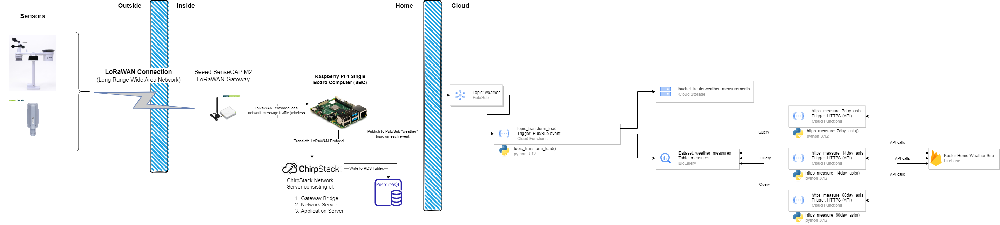

# The Kester Weather Station

## Why

...Why not? 

Through this project the kids can learn basics of sensors in the real world, wireless networks, databases, and the power of cloud technologies. At the end, they will be able to point their friends and family from around the world to a website to see how hot it is, how much rain we've gotten, the air quality, etc. near their home. 

## High Level Diagram  

The diagram below show, at a high level, what we want to set up. Essentially, we want to have one SEEED sensor (to start), the 8-in-1 Weather sensor, that is connected to a computer inside the house and communicates over a Long Range Wide Area Network (LoRaWAN). The sensor will connect to a LoRaWAN gateway that will convert the wireless communication into a digital, computer readable format. That will then connect to a ChirpStack server on our local Raspberry Pi computer. This ChirpStack server will feed the data recieved from the sensor into a PostgreSQL Database stored on the Raspberry Pi. The Raspberry Pi will then push that data periodically to a Google Cloud Platform (GCP) managed database (likely PostgreSQL initially for ease of use). Finally, we will create a static web-page using Quarto and Observable JS, deployed to Google Firebase to query the GCP database and chart the results.

  

## References  

The following are links to resources we will use to set up the components show in the diagram above.  

  * Seeed Components:  
    * [SenseCAP S2120 8-in-1 LoRaWAN Weather Sensor](https://www.seeedstudio.com/sensecap-s2120-lorawan-8-in-1-weather-sensor-p-5436.html). This reference is the Seeed Studio page to purchase the item.  
      * [Getting Started with the SenseCAP S2120](https://wiki.seeedstudio.com/Sensor/SenseCAP/SenseCAP_LoRaWAN_Sensor/SenseCAP_S2120_8-in-1_LoRaWAN_Weather_Sensor/SenseCAP_S2120_8-in-1_LoRaWAN_Weather_Sensor_Introduction/). This reference is a technical wiki on getting started with this sensor and integrating it into the LoRaWAN network.  
    * [SenseCAP M2 Multi-Platform LoRaWAN Indoor Gateway (SX1302)](https://www.seeedstudio.com/SenseCAP-Multi-Platform-LoRaWAN-Indoor-Gateway-SX1302-EU868-p-5471.html). This reference is the Seeed Studio page to purchase the item.  
      * [Connecting SenseCAP M2 Gateway to ChirpStack](https://wiki.seeedstudio.com/Network/SenseCAP_Network/SenseCAP_M2_Multi_Platform/Tutorial/Connect-M2-Multi-Platform-Gateway-to-ChirpStack/). This reference is the technical wiki on how to connect the gateway to ChirpStack.  
  * Raspberry Pi:  
    * ChirpStack:  
      * [Main documentation](https://www.chirpstack.io/): "ChirpStack is an open-source LoRaWAN Network Server which can be used to setup LoRaWAN networks. ChripStack provides a web-interface for the management of gateways, devices, and tenants as well to setup data integrations with the major cloud providers, databases, and services commonly used for handling device data. ChirpStack provides a gRPC based API that can be used to integrate or extend ChirpStack."  
      * [Installing ChirpStack on Raspberry Pi](https://www.chirpstack.io/project/guides/raspberry-pi/) <- for version 3 or for version 4 -> [Quickstart Raspberry Pi](https://www.chirpstack.io/docs/getting-started/raspberry-pi.html)  
      * [Setting up a private LoRaWAN Sensor Network](https://forum.digikey.com/t/set-up-a-private-lorawan-sensor-network-with-machinechat-and-seeed-sensecap/18460). This includes more than what is shown on my diagram but may become useful as we go through this. I'm not sure how JEDI Pro SSE would be useful but if this can provide some basic dashboarding that we can deploy as an external website, that may be useful.  
    * Firebase:  
      * Firestore: [Interacting with Firestore from Observable from within Firebase](https://observablehq.com/@taeold/introduction-to-serverless-notebooks-firebase-edition)  
    * Quarto:  
      * Using Observable JS: [How to use Observable JS in Quarto](https://quarto.org/docs/interactive/ojs/#overview)  
      * Accessing data. You can do this in R or Python through an API call and then pass it to observable during render but this doesn't make the webpage interactive with current data. You can also call Firestore directly from observable JS which is probably the way to go. [Quarto - Data Sources](https://quarto.org/docs/interactive/ojs/data-sources.html#overview).  
      * [Google Cloud FireStore REST API documentation](https://firebase.google.com/docs/firestore/use-rest-api). This walks us through how we can query the FireStore collection via an REST API with a token.  
      * [Interacting with Data from Observable JS](https://observablehq.com/@observablehq/introduction-to-data?collection=@observablehq/notebook-fundamentals#apis) 


## The Approach  

I decided to take this approach rather than building our own sensors because it allows us to get a prototype up and operational quicker so we can see how the various components work. If we took the approach of building components ourselves, we would have gotten mired in figuring out how to deploy them into the environment while protecting them from corrosion, etc. These Seeed sensors do that for us and provide the networking required to make it work. In a future project I'd like to get them into buiding the circuits, etc. 


## The Equipment  

This is the final list of equipment:  

  * Raspberry Pi 3, purchased in 2017  
    * Loaded with Ubuntu Server 22.04 LTS: We went with this so we had the full power and options of Ubuntu (as compared to Raspberry OS) while minimizing the overhead that comes with loading Ubuntu Desktop.  
    * 10 GB micro SD memory card
  * The Seeed Studio equipment  
    * SeeedStudio SenseCAP S2120 LoRaWAN 8-in-1 Weather Station ([Manual Here](./documents/SenseCAP%20S2120%20LoRaWAN%208-in-1%20Weather%20Station%20User%20Guide.pdf))  
    * SeeedStudio SenseCAP M2 LoRaWAN Indoor Gateway  
      * [M2 Quick Start](./documents/Quick%20Start%20for%20SenseCAP%20M2%20Gateway%20%26%20Sensors.pdf)
      * [Connecting the M2 to ChirpStack](./documents/Connect_M2_Multi-Platform_Gateway_to_ChirpStack.pdf)  

## Setting up the Raspberry Pi  

The Raspberry Pi we used was originally purchased through Woot.com in 2017. I intended to use it to create an arcade game console with the kids but we weren't ready for that yet. The build comes from https://www.canakit.com/. The kit came with an SD card pre-loaded with the 2017 version of NOOBs. This did not have the option to install Ubuntu so I used the Raspberry Pi Installer, avalaible here at the [Raspberry Pi Website](https://www.raspberrypi.com/software/) and flashed the SD card with Ubuntu Server 22.04 LTS. Using this approach was helpful because it pre-loaded the login information for my WiFi network and performed some other configurations that made it easy to get started once in the Raspberry Pi.

Through the Raspberry Pi Installer we set our WiFi connection information, out hostname (`kesterweather`), our username (`kesterweather`), and our password.

Once we put the Raspberry Pi 3 kit together and started it up, we ran a standard `update` and `upgrade` before moving forward with the following code:  

```{bash}
sudo apt update

sudo apt upgrade -y
```  

At this point we were ready to start installing the required components for Chirpstack.  

## Setting up Chirpstack  

We used this project's companion, `1_initialplan` as well as these ChirpStack documents: [ChirpStack Ubuntu Docs](https://www.chirpstack.io/docs/getting-started/debian-ubuntu.html)  

### Install Required Libraries  

First to install the libraries required to support ChirpStack:  

```{bash}
sudo apt install -y \
    mosquitto \
    mosquitto-clients \
    redis-server \
    redis-tools \
    postgresql 
```  

### What are these things??

  *[Mosquitto](https://www.eginnovations.com/documentation/Mosquitto-MQTT/What-is-Mosquitto-MQTT.htm#:~:text=Eclipse%20Mosquitto%20is%20an%20open,board%20computers%20to%20full%20servers.): is a message broker the implements the MQTT protocol. This allows us to use a publish/subscribe mode (pub/sub). This allows things to send messages to each other as needed. In this example our weather station is able to publish messages every time it has new readings. That will be however often we tell it to. They are organized like this:  
    * Publisher: The device that sends messages (our weather station)  
    * Messages: This is the information that the devices are sending to each other
    * Topics: These are the categories of information. For instance, there may be (I'm not sure yet) a topic for each type of sensor on our weather station. One topic for temperature, one for wind speed, one for wind direction, etc.  
    * Broker: This is the system that receives the messages and sends them on to the subscribers subscribed to that topic. This is probably our Raspberry Pi. More precisely it is probably the `Mosquitto` program on the Raspberry Pi.  
  * [Redis Server](https://backendless.com/redis-what-it-is-what-it-does-and-why-you-should-care/#:~:text=Redis%20is%20an%20open%20source,transactions%20and%20publish%2Fsubscribe%20messaging): is a database or message broker for publish/subscribe messaging (pub/sub). It is used, normally, to temporarily store data. It is good because it is very fast because it holds everything in memory. 
  * [Postres](https://www.postgresql.org/about/): PostgreSQL is a powerful relational database used to easily store very large volumes of data.  
    * What is a [relational database](https://aws.amazon.com/relational-database/#:~:text=A%20relational%20database%20is%20a,be%20represented%20in%20the%20database.)? They are a group of tables (rows and columns) of data that each store a certain type of information but can also be related to each other and combined to get more information. 

### Setting up PostgreSQL  

This will configure our `postgres` server (*note*: we refer to PostgreSQL as either PostgreSQL or postgres).  

First, start PostgreSQL (CLI tool is `psql`) as the default user `postgres`  

```
sudo -u postgres psql
```  

Now we want to create a role for chirpstack 

```{sql}
-- create role for authentication
create role chirpstack with login password 'chirpstack';
```  

Then we want to create a database  
```{sql}
-- create database
create database chirpstack with owner chirpstack;
```


```{sql}
-- connect to the chirpstack database
\c chirpstack
```

The following extension to postgres supports better matching between text strings. I imagine we do this because of the messages `mosquitto` and the sensor will provide. Specifically, it deal with trigrams.  

[Documentation on pg_trm](https://www.postgresql.org/docs/current/pgtrgm.html)

```{sql}
---create pg_trgm extension
create extension pg_trgm;
```

Exit the `psql` tool  

```{sql}
\q
```  

### Install ChirpStack  

This is the next step